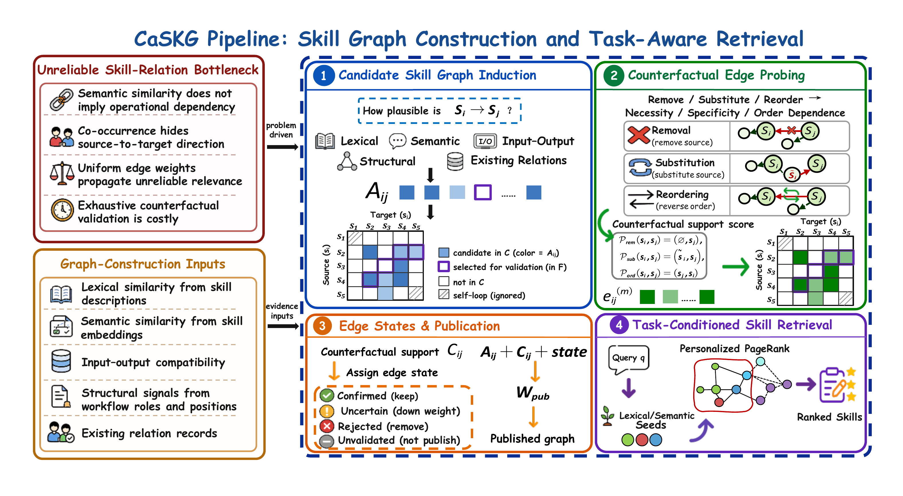

<h1 align="center">🔗 CaSKG</h1>

<p align="center">
  <strong>Counterfactual-Causal Skill Graphs for Scalable Agent Skill Retrieval</strong>
</p>

<p align="center">
  🧩 Candidate Graph Induction &nbsp;·&nbsp;
  🧪 Counterfactual Calibration &nbsp;·&nbsp;
  🎯 Task-Conditioned Retrieval
</p>

<p align="center">
  <strong>Zhiyuan Li</strong><sup>1,2,*</sup> &middot;
  <strong>Linyuan Gao</strong><sup>1,*</sup> &middot;
  <strong>Xuechun Ding</strong><sup>2</sup> &middot;
  <strong>Hongwei Chen</strong><sup>2,&dagger;</sup>
  <br>
  <strong>Yuan Wu</strong><sup>1,&dagger;</sup> &middot;
  <strong>Yi Chang</strong><sup>1</sup>
</p>

<p align="center">
  <picture>
    <source media="(prefers-color-scheme: dark)" srcset="jilin-university-badge-reverse.png">
    
  </picture>
  &nbsp;&nbsp;&nbsp;
  <picture>
    <source media="(prefers-color-scheme: dark)" srcset="ant-group-logo-en-reverse-trimmed.png">
    
  </picture>
</p>

<p align="center">
  <sup>1</sup> School of Artificial Intelligence, Jilin University
  &nbsp;·&nbsp;
  <sup>2</sup> Ant Group
  <br>
  <sub><sup>*</sup> Equal contribution &nbsp;·&nbsp; <sup>&dagger;</sup> Co-corresponding authors</sub>
  <br>
  <sub>Work done while Zhiyuan Li was an intern at Ant Group.</sub>
</p>

<p align="center">
  🐍 <strong>Python 3.10-3.12</strong> &nbsp;·&nbsp;
  📦 <strong>uv</strong> &nbsp;·&nbsp;
  📚 <strong>Skill1000</strong>
  <br>
  🏠 <strong>ALFWorld ID-140</strong> &nbsp;·&nbsp;
  🔬 <strong>ScienceWorld U211</strong>
</p>

<p align="center">
  <a href="#overview">Overview</a> &middot;
  <a href="#method">Method</a> &middot;
  <a href="#results">Results</a> &middot;
  <a href="#installation">Installation</a> &middot;
  <a href="#quick-start">Quick Start</a>
  <br>
  <a href="#agent-integration">Agent Integration</a> &middot;
  <a href="#evaluation">Evaluation</a>
</p>

---

<a id="overview"></a>
## 🧩 CaSKG at a Glance

Large skill libraries broaden what an LLM agent can do, but they also make retrieval harder. Full-library prompting introduces irrelevant procedures, independent vector retrieval can miss workflow dependencies, and graph expansion is useful only when the relations carrying relevance are reliable.

**CaSKG** constructs a counterfactual-causal skill graph offline and retrieves a compact, executable skill bundle at task time. It separates broad candidate discovery from relation-reliability calibration: multiple skill-level signals propose directed relations, counterfactual probes assess a budgeted subset, and edge states determine publication and retrieval weight.

<p align="center">
  
</p>

<p align="center">
  <em><strong>Figure 1.</strong> Stages 1-3 construct and calibrate the graph offline; Stage 4 retrieves a task-conditioned skill bundle from the frozen graph.</em>
</p>

<a id="method"></a>
## ⚙️ Method

1. **Candidate graph induction.** Construct a high-recall directed graph from lexical, semantic, input/output, structural, and existing-relation evidence.
2. **Counterfactual edge probing.** Apply direction-conditioned removal, substitution, and reordering probes to a budgeted edge frontier, then aggregate the evidence with Beta smoothing.
3. **State-gated publication.** Retain confirmed relations, attenuate uncertain ones, reject unsupported ones, and keep a bounded low-weight scaffold of deferred candidates by default.
4. **Task-conditioned retrieval.** Seed from lexical and semantic matches, diffuse relevance over the frozen graph with personalized PageRank, and return a bounded skill bundle.

> **Scope.** The textual probes calibrate the operational reliability of proposed directed relations; they are not claims of real-world causality. Deferred, unvalidated candidates can remain only as bounded low-weight scaffold edges in the default runtime graph.

<a id="results"></a>
## 📊 Results

We evaluate four skill-access methods with a frozen **Skill1000** library across six LLM backbones:

- **Vanilla Skills:** expose the complete skill catalog.
- **Vector Skills:** retrieve skills independently by embedding similarity.
- **Graph-of-Skills (GoS):** retrieve over a dependency-aware skill graph.
- **CaSKG:** retrieve over a state-weighted graph containing calibrated relations and bounded low-weight scaffold edges.

The evaluation uses **ALFWorld ID-140** (140 in-distribution household episodes) and **ScienceWorld U211** (211 selected official-test episodes across 24 task types). ALFWorld `R` is success rate in percent; ScienceWorld `R` is the mean best official score on the 0-to-100 scale. `Steps` reproduces each runner's episode counter: agent turns for the current ALFWorld runner and environment actions for ScienceWorld.

### 🏆 Main Results (End-to-End)

<p align="center">
  <strong>🏆 Highest observed task score in 12/12 model-benchmark settings</strong>
  &nbsp;·&nbsp;
  <strong>⚡ Fewest reported Steps in 11/12 settings</strong>
</p>

Higher `R` and fewer `Steps` are better. Bold numbers mark the best observed result for each model and metric.

| Model | Method | ALFWorld R (%) ↑ | ALFWorld Steps ↓ | ScienceWorld R ↑ | ScienceWorld Steps ↓ |
|:---|:---|---:|---:|---:|---:|
| MiniMax-M2.7 | Vanilla | 42.90 | 22.54 | 45.90 | 21.73 |
|  | Vector | 45.70 | 22.84 | 43.21 | 21.45 |
|  | GoS | 63.60 | 19.69 | 55.85 | 18.91 |
|  | **CaSKG** | **73.57** | **18.44** | **68.33** | **17.45** |
| GLM-5.2 | Vanilla | 95.00 | 11.05 | 75.50 | 17.03 |
|  | Vector | 96.43 | 10.12 | 77.07 | 16.65 |
|  | GoS | 95.71 | 9.91 | 80.33 | 15.75 |
|  | **CaSKG** | **97.86** | **9.69** | **85.11** | **14.52** |
| Kimi-K2.6 | Vanilla | 77.90 | 16.07 | 72.23 | 18.91 |
|  | Vector | 90.00 | 13.49 | 72.58 | 17.55 |
|  | GoS | 93.60 | 13.08 | 76.82 | 16.15 |
|  | **CaSKG** | **95.00** | **12.34** | **83.88** | **15.43** |
| Qwen3.5-397B-A17B | Vanilla | 79.30 | 15.60 | 63.72 | 18.34 |
|  | Vector | 78.60 | 15.49 | 62.60 | 18.51 |
|  | GoS | 88.60 | 14.15 | 63.18 | 17.08 |
|  | **CaSKG** | **92.14** | **11.60** | **74.97** | **15.56** |
| DeepSeek-V4-Flash | Vanilla | 72.86 | 16.91 | 64.84 | 18.49 |
|  | Vector | 78.57 | 16.89 | 68.65 | 18.39 |
|  | GoS | 77.86 | 17.09 | 73.45 | 16.20 |
|  | **CaSKG** | **86.43** | **14.41** | **83.40** | **15.61** |
| GPT-5.6-Luna | Vanilla | 72.86 | **17.74** | 84.09 | 14.99 |
|  | Vector | 55.00 | 22.06 | 84.09 | 14.40 |
|  | GoS | 60.71 | 21.86 | 86.08 | 14.22 |
|  | **CaSKG** | **75.71** | 17.79 | **87.33** | **13.18** |

Across the six-model macro-average, CaSKG improves `R` from **80.01% to 86.79%** on ALFWorld and from **72.62 to 80.50** on ScienceWorld relative to GoS. Reported mean Steps fall from **15.96 to 14.05** and from **16.39 to 15.29**, respectively.

<a id="library-size"></a>
## 📚 Performance across Skill-Library Sizes

Archived ALFWorld ID-140 aggregates compare CaSKG with GoS at nominal library sizes of 200, 500, 1,000, and 2,000 skills for MiniMax-M2.7 and Qwen3.5-397B-A17B.

<p align="center">
  
</p>

<p align="center">
  <em><strong>Figure 2.</strong> CaSKG and GoS performance at four nominal skill-library sizes.</em>
</p>

Across all eight archived backbone-size comparisons, CaSKG records higher success and fewer reported Steps than GoS. The success difference ranges from **+3.54 to +22.86 percentage points**, while the Steps difference ranges from **1.25 to 4.46**. The best observed CaSKG success occurs at 1,000 skills for MiniMax and 500 for Qwen; neither CaSKG curve is monotonic.

<details>
<summary><strong>Exact library-size results</strong></summary>

| Model | Skills | CaSKG R (%) | GoS R (%) | CaSKG Steps | GoS Steps |
|:---|---:|---:|---:|---:|---:|
| MiniMax-M2.7 | 200 | **57.14** | 50.00 | **20.73** | 22.21 |
|  | 500 | **67.86** | 45.00 | **19.95** | 23.07 |
|  | 1,000 | **73.57** | 63.60 | **18.44** | 19.69 |
|  | 2,000 | **70.00** | 54.29 | **18.71** | 21.32 |
| Qwen3.5-397B-A17B | 200 | **85.00** | 76.43 | **14.50** | 16.25 |
|  | 500 | **94.29** | 72.86 | **12.48** | 16.94 |
|  | 1,000 | **92.14** | 88.60 | **11.60** | 14.15 |
|  | 2,000 | **91.43** | 77.86 | **12.31** | 16.47 |

</details>

> **Interpretation boundary.** This is a descriptive system-level comparison, not a controlled size-only ablation or compute benchmark. The archived records do not establish that all four libraries are nested or differ only in size.

<a id="component-analysis"></a>
## 🧪 Graph-Construction Component Analysis

The component comparison uses MiniMax-M2.7, Skill1000, ALFWorld ID-140, the same 140-task cohort, and a 30-step limit. `C`, `F`, and E<sub>pub</sub> denote candidate, counterfactually assessed, and published relations.

| Variant | C | F | E<sub>pub</sub> | R (%) ↑ | Steps ↓ |
|:---|---:|---:|---:|---:|---:|
| **Full CaSKG** | 9,937 | 500 | 3,292 | **73.57** | **18.44** |
| Semantic-only candidates | 3,982 | 500 | 2,698 | 67.14 | 19.21 |
| Without candidate-stage LLM judge | 9,753 | 500 | 3,188 | 71.43 | 18.79 |
| Publish all candidates | 9,937 | 0 | 9,937 | 71.43 | 18.74 |

- **Broad candidate induction** contributes 6.43 percentage points over semantic-only candidates.
- **Judge-assisted candidate scoring** contributes 2.14 percentage points under this configuration.
- **Counterfactual assessment and state-gated publication** outperform publishing every candidate by 2.14 percentage points.

> `F` counts assessed relations, not individual probe calls. The no-judge variant removes only the candidate-stage judge and still uses later LLM counterfactual probes. These are single-cohort aggregates without repeated-run uncertainty estimates.

<a id="installation"></a>
## 📦 Installation

### Requirements

- Python 3.10 through 3.12; the lock file and `.python-version` use Python 3.12.13.
- [`uv`](https://docs.astral.sh/uv/) for the locked environment.
- OpenAI-compatible chat and embedding services for graph construction and retrieval.

Docker is **not required** for CaSKG, ALFWorld, or ScienceWorld in this repository.

### Setup

From the repository root:

```bash
uv python install 3.12.13
uv sync --frozen
cp .env.example .env
```

On PowerShell, use:

```powershell
uv python install 3.12.13
uv sync --frozen
Copy-Item .env.example .env
```

Configure the following values in `.env` and never commit credentials:

| Variable | Purpose |
|:---|:---|
| `OPENAI_API_KEY`, `OPENAI_BASE_URL` | OpenAI-compatible services used during graph construction and retrieval |
| `API_KEY`, `BASE_URL` | Chat service used by the basic ALFWorld runner |
| `CASKG_LLM_MODEL` | Model used for candidate scoring and counterfactual probes |
| `CASKG_EMBEDDING_MODEL` | Embedding model used for indexing and retrieval |
| `CASKG_EMBEDDING_DIM` | Embedding dimension; it must match the model and workspace |
| `CASKG_WORKING_DIR` | Default CaSKG workspace |

<a id="quick-start"></a>
## 🚀 Quick Start

> **External assets required.** Skill1000 and the frozen paper workspace are not currently bundled with this repository. The workflow below builds a new workspace from a separately obtained skill corpus; exact paper-result reproduction additionally requires the archived workspace, model routes, baselines, and raw runs.

### Step 1: Prepare a Skill Library

```text
data/
|-- skillsets/
|   `-- skills_1000/
|       `-- <skill-name>/SKILL.md
`-- caskg_workspace/
    `-- skills_1000/
```

Each `SKILL.md` needs nonempty `name` and `description` fields in its YAML frontmatter. For the paper workflow, keep the directory basename identical to `name`.

```markdown
---
name: summarize-table
description: Summarize a structured table and report the main comparisons.
---

# Summarize a Table

Inspect the headers, compare the requested rows or columns, and report the
largest differences together with the units.
```

### Step 2: Build the Candidate Graph

```bash
uv run caskg-index data/skillsets/skills_1000 \
  --workspace data/caskg_workspace/skills_1000 \
  --clear
```

This indexes skill nodes, computes embeddings, induces directed candidate relations, and publishes an initial runtime graph. `--clear` removes the target workspace before rebuilding it; omit the flag when that workspace must be preserved.

### Step 3: Calibrate and Publish Relations

```bash
uv run python experiments/run_validation.py \
  --workspace data/caskg_workspace/skills_1000 \
  --skills-dir data/skillsets/skills_1000 \
  --probe-types removal,substitution,reordering \
  --threshold 0.05 \
  --max-edges 500 \
  --resume \
  --call-delay 1.05 \
  --batch-concurrency 16 \
  --seed 42
```

Validation can issue many paid remote requests. Adjust `--max-edges` and `--batch-concurrency` to the provider's limits, and preserve the validation log together with its workspace checkpoint.

### Step 4: Retrieve and Inspect

```bash
uv run caskg retrieve "plan a multi-step task" \
  --workspace data/caskg_workspace/skills_1000 \
  --max-skills 8 \
  --json

uv run caskg status \
  --workspace data/caskg_workspace/skills_1000
```

The retrieval response contains ranked skills and hydrated context that can be passed directly to an agent.

<a id="agent-integration"></a>
## 🔌 Agent Integration

The command line is the canonical local interface. An MCP server is available for agents that support tool-based retrieval, but it is optional and is not used by the benchmark runners.

### Command Line

| Workflow | Entry point |
|:---|:---|
| Build a candidate graph | `caskg-index <skill-directory>` |
| Calibrate relation reliability | `python experiments/run_validation.py` |
| Retrieve an agent-ready bundle | `caskg retrieve <task> --json` |
| Inspect a workspace | `caskg status` |

Run `uv run caskg --help`, `uv run caskg-index --help`, or `uv run python experiments/run_validation.py --help` for complete option lists.

### MCP Server (Optional)

Set `CASKG_WORKING_DIR` to a prepared workspace and start the stdio server:

```bash
uv run caskg-server
```

| Tool | Purpose |
|:---|:---|
| `search_skills` | Return a concise summary of relevant skills |
| `retrieve_skill_bundle` | Return ranked skills and hydrated context |
| `hydrate_skills` | Load full content for known skill names |
| `get_graph_info` | Report graph size and retrieval defaults |

Register `uv run caskg-server` manually in the MCP client and run it from the repository root. No Docker or client-specific container wrapper is needed.

<a id="evaluation"></a>
## 📋 Evaluation

Both benchmarks run as local environments and call the CaSKG retrieval adapter directly. The examples below run one CaSKG condition; they are not a turnkey reproduction of every row in the six-model table.

### ALFWorld ID-140

Use Linux or WSL for the pinned paper environment; the ALFWorld/TextWorld/Jericho dependency chain is not reliably installable on native Windows with Python 3.12.

```bash
uv sync --frozen --extra alfworld
uv run alfworld-download --data-dir data/alfworld
export ALFWORLD_DATA="$PWD/data/alfworld"

uv run python evaluation/alfworld_run.py \
  --model MiniMax-M2.7 \
  --split dev \
  --max_workers 4 \
  --max_steps 30 \
  --exp_name skills_1000 \
  --use_skill \
  --mode caskg \
  --caskg_workspace data/caskg_workspace/skills_1000 \
  --skills_dir data/skillsets/skills_1000
```

When neither `--max_games` nor `--task_indices` is supplied, `--split dev` selects the intended 140 in-distribution games. Use a unique `--exp_name` and an empty output directory for every configuration.

### ScienceWorld U211

ScienceWorld requires Java and the pinned Python packages:

```bash
uv pip install "scienceworld==1.2.3" "py4j==0.10.9.9"
java -version
```

Validate the frozen 211-episode protocol, then run a retrieval preflight:

```bash
uv run python -m evaluation.scienceworld_eto211_run --validate-only

uv run python -m evaluation.scienceworld_eto211_run \
  --retriever caskg \
  --max-episodes 1 \
  --retrieval-preflight
```

A complete model run requires the controlled OpenAI-compatible router and expected provider headers used by the evaluation protocol:

```bash
uv run python -m evaluation.scienceworld_eto211_run \
  --retriever caskg \
  --model MiniMax-M2.7 \
  --api-base "$SCIENCEWORLD_ROUTER_BASE_URL" \
  --api-key-env ROUTER_MASTER_KEY \
  --expected-router-provider "$CASKG_EXPECTED_CHAT_PROVIDER" \
  --run-cohort caskg-u211 \
  --max-workers 4 \
  --output-dir results/scienceworld
```

<a id="development"></a>
## 🛠️ Development

Core checks do not require a live model endpoint or graph workspace:

```bash
uv run pytest -m "not integration" tests
uv run python -m compileall -q caskg experiments evaluation tests
```

<details>
<summary><strong>Repository layout</strong></summary>

```text
.
|-- caskg/
|   |-- causal/             Candidate induction, probes, states, publication
|   |-- core/               Skill parsing, graph storage, online retrieval
|   |-- interfaces/         CLI and MCP entry points
|   `-- utils/              Environment-based configuration
|-- experiments/            Counterfactual edge-calibration runner
|-- evaluation/             ALFWorld and ScienceWorld runners
|-- configs/                Frozen evaluation and retriever configuration
|-- manifests/              Frozen episode identities and checksums
|-- prompts/                Frozen evaluation prompts
|-- tests/                  Core and integration tests
|-- CaSKG_method_overview_final.png
|-- fig_library_size_sensitivity.png
|-- .env.example
|-- pyproject.toml
`-- uv.lock
```

</details>

<a id="authors"></a>
## 👥 Authors and Affiliations

| Author | Affiliation(s) | Email | Note |
|:---|:---|:---|:---|
| Zhiyuan Li | Jilin University; Ant Group | [zhiyuanl24@mails.jlu.edu.cn](mailto:zhiyuanl24@mails.jlu.edu.cn) | Equal contribution; work done while an intern at Ant Group |
| Linyuan Gao | Jilin University | [lygao25@mails.jlu.edu.cn](mailto:lygao25@mails.jlu.edu.cn) | Equal contribution |
| Xuechun Ding | Ant Group | [dingxuechun.dxc@antgroup.com](mailto:dingxuechun.dxc@antgroup.com) |  |
| Hongwei Chen | Ant Group | [wei.chenhw@antgroup.com](mailto:wei.chenhw@antgroup.com) | Co-corresponding author |
| Yuan Wu | Jilin University | [yuanwu@jlu.edu.cn](mailto:yuanwu@jlu.edu.cn) | Co-corresponding author |
| Yi Chang | Jilin University | [yichang@jlu.edu.cn](mailto:yichang@jlu.edu.cn) |  |

The affiliation marks at the top identify the authors' institutions and do not imply endorsement of this repository. Their official sources are recorded in [`LOGO_SOURCES.md`](LOGO_SOURCES.md).
