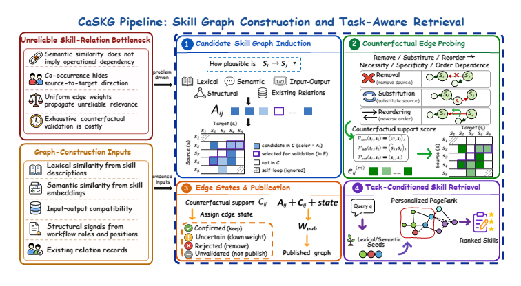

<h1 align="center">CaSKG</h1>

<p align="center">
  <strong>Counterfactual-Causal Skill Graphs for Scalable Agent Skill Retrieval</strong>
</p>

<p align="center">
  <a href="mailto:zhiyuanl24@mails.jlu.edu.cn"><strong>Zhiyuan Li</strong></a><sup>1,2,*</sup> &middot;
  <a href="mailto:lygao25@mails.jlu.edu.cn"><strong>Linyuan Gao</strong></a><sup>1,*</sup> &middot;
  <a href="mailto:dingxuechun.dxc@antgroup.com"><strong>Xuechun Ding</strong></a><sup>2</sup> &middot;
  <a href="mailto:wei.chenhw@antgroup.com"><strong>Hongwei Chen</strong></a><sup>2,&dagger;</sup> &middot;
  <a href="mailto:yuanwu@jlu.edu.cn"><strong>Yuan Wu</strong></a><sup>1,&dagger;</sup> &middot;
  <a href="mailto:yichang@jlu.edu.cn"><strong>Yi Chang</strong></a><sup>1</sup>
</p>

<p align="center">
  <sup>1</sup> School of Artificial Intelligence, Jilin University &nbsp;&nbsp;
  <sup>2</sup> Ant Group
</p>

<p align="center">
  <sup>*</sup> Equal contribution &nbsp;&nbsp; <sup>&dagger;</sup> Co-corresponding authors
  <br>
  <sub>Work done while Zhiyuan Li was an intern at Ant Group.</sub>
</p>

<p align="center">
  
  
  
</p>

<p align="center">
  <a href="#overview">Overview</a> &middot;
  <a href="#results">Results</a> &middot;
  <a href="#installation">Installation</a> &middot;
  <a href="#quick-start">Quick Start</a> &middot;
  <a href="#agent-integration">Agent Integration</a> &middot;
  <a href="#evaluation">Evaluation</a>
</p>

---

## Overview

Large skill libraries broaden what an LLM agent can do, but they also make retrieval harder. Full-library prompting introduces irrelevant procedures, independent vector retrieval can miss workflow dependencies, and graph expansion is useful only when the relations carrying relevance are reliable.

**CaSKG** builds a counterfactual-causal skill graph offline, then retrieves a compact, executable skill bundle for each task. It separates broad candidate discovery from relation-reliability calibration: multiple skill-level signals propose directed relations, direction-conditioned textual counterfactual probes assess a budgeted subset, and edge states determine which relations are published and how strongly they influence retrieval. By default, a bounded set of deferred, unvalidated candidates remains in the runtime graph as low-weight scaffold edges.

<p align="center">
  
</p>

<p align="center">
  <em>CaSKG constructs and calibrates the graph offline, then freezes it for task-time retrieval.</em>
  <br>
  <a href="assets/CaSKG_method_overview_final.pdf">High-resolution figure (PDF)</a>
</p>

**Pipeline.**

1. **Candidate graph induction:** construct a high-recall directed graph from lexical, semantic, input/output, and structural evidence.
2. **Counterfactual edge probing:** apply direction-conditioned removal, substitution, and reordering probes to a budgeted edge frontier, then aggregate the evidence with Beta smoothing.
3. **State-gated publication:** retain confirmed relations, attenuate uncertain ones, reject unsupported ones, and, by default, keep a bounded low-weight scaffold of deferred candidates.
4. **Task-conditioned retrieval:** seed from lexical and semantic matches, diffuse relevance over the frozen graph with personalized PageRank, and return a bounded skill bundle.

The textual probes calibrate the operational reliability of proposed directed relations; they are not claims of real-world causality.

## Results

We evaluate four skill-access methods with a frozen **Skill1000** library across six LLM backbones:

- **Vanilla Skills:** expose the complete skill catalog.
- **Vector Skills:** retrieve skills independently by embedding similarity.
- **Graph-of-Skills (GoS):** retrieve over a dependency-aware skill graph.
- **CaSKG:** retrieve over a state-weighted graph containing calibrated relations and bounded low-weight scaffold edges.

The two complete interactive cohorts are **ALFWorld ID-140** (140 in-distribution household episodes) and **ScienceWorld U211** (211 selected episodes spanning 24 task types from the official test split). For ALFWorld, `R` is success rate in percent. For ScienceWorld, `R` is the arithmetic mean of each episode's best official score on the 0-to-100 scale and is not a percentage. **Steps** reproduces each runner's per-episode counter: ScienceWorld increments it on environment actions, while the current ALFWorld runner increments it once per agent turn, including retrieval or action-repair turns that may not call `env.step`. It does not measure tokens, latency, graph-construction cost, or success-conditioned efficiency. Higher `R` and fewer Steps are better.

Within each benchmark, all methods use the same task cohort, base prompt, evaluator, episode limits, and environment interaction loop. The retrieval structure is frozen before evaluation and the retrieved skill context is the intended method-specific difference.

### Main Results (End-to-End)

| Model | Method | ALFWorld R (%) | ALFWorld Steps | ScienceWorld R | ScienceWorld Steps |
|---|---|---:|---:|---:|---:|
| MiniMax-M2.7 | Vanilla | 42.90 | 22.54 | 45.90 | 21.73 |
|  | Vector | 45.70 | 22.84 | 43.21 | 21.45 |
|  | GoS | 63.60 | 19.69 | 55.85 | 18.91 |
|  | **CaSKG** | **73.57** | **18.44** | **68.33** | **17.45** |
| GLM-5.2 | Vanilla | 95.00 | 11.05 | 75.50 | 17.03 |
|  | Vector | 96.43 | 10.12 | 77.07 | 16.65 |
|  | GoS | 95.71 | 9.91 | 80.33 | 15.75 |
|  | **CaSKG** | **97.86** | **9.69** | **85.11** | **14.52** |
| Kimi-K2.6 | Vanilla | 77.90 | 16.07 | 72.23 | 18.91 |
|  | Vector | 90.00 | 13.49 | 72.58 | 17.55 |
|  | GoS | 93.60 | 13.08 | 76.82 | 16.15 |
|  | **CaSKG** | **95.00** | **12.34** | **83.88** | **15.43** |
| Qwen3.5-397B-A17B | Vanilla | 79.30 | 15.60 | 63.72 | 18.34 |
|  | Vector | 78.60 | 15.49 | 62.60 | 18.51 |
|  | GoS | 88.60 | 14.15 | 63.18 | 17.08 |
|  | **CaSKG** | **92.14** | **11.60** | **74.97** | **15.56** |
| DeepSeek-V4-Flash | Vanilla | 72.86 | 16.91 | 64.84 | 18.49 |
|  | Vector | 78.57 | 16.89 | 68.65 | 18.39 |
|  | GoS | 77.86 | 17.09 | 73.45 | 16.20 |
|  | **CaSKG** | **86.43** | **14.41** | **83.40** | **15.61** |
| GPT-5.6-Luna | Vanilla | 72.86 | **17.74** | 84.09 | 14.99 |
|  | Vector | 55.00 | 22.06 | 84.09 | 14.40 |
|  | GoS | 60.71 | 21.86 | 86.08 | 14.22 |
|  | **CaSKG** | **75.71** | 17.79 | **87.33** | **13.18** |

CaSKG achieves the highest task score in all **12 model-benchmark combinations**. Relative to GoS, the six-model macro-average improves from **80.01% to 86.79%** on ALFWorld and from **72.62 to 80.50** on ScienceWorld, while reported mean Steps fall from **15.96 to 14.05** and from **16.39 to 15.29**, respectively.

CaSKG also uses fewer steps than GoS in every setting and has the lowest step count among all methods in 11 of 12 settings. The exception is GPT-5.6-Luna on ALFWorld, where Vanilla is 0.05 steps shorter but 2.85 percentage points less successful.

### Scaling with Library Size

We compare CaSKG with GoS on ALFWorld ID-140 as the library grows from 200 to 2,000 skills.

> **Interpretation boundary.** This is an archived descriptive system-level comparison, not a fixed-budget complexity experiment. The MiniMax runs assess 500 candidate relations at 200 to 1,000 skills and 2,000 relations at 2,000 skills; the Qwen GoS values come from archived aggregates rather than matching episode directories.

<p align="center">
  
</p>

<p align="center">
  <em>Archived source figure; interpret its "environment steps" axis as the ALFWorld Steps counter defined above.</em>
  <br>
  <a href="assets/fig_library_size_sensitivity.pdf">High-resolution figure (PDF)</a>
</p>

Across all eight backbone-library-size combinations, CaSKG has both higher success and lower reported Steps than GoS. The success-rate advantage ranges from **+3.54 to +22.86 percentage points**, while the reduction ranges from **1.25 to 4.46 steps**. The best observed library size differs by backbone, so the curves should not be read as monotonic scaling laws.

<details>
<summary><strong>Exact values and comparison scope</strong></summary>

| Model | Skills | CaSKG R (%) | GoS R (%) | Delta R (pp) | CaSKG Steps | GoS Steps |
|---|---:|---:|---:|---:|---:|---:|
| MiniMax-M2.7 | 200 | **57.14** | 50.00 | +7.14 | **20.73** | 22.21 |
|  | 500 | **67.86** | 45.00 | +22.86 | **19.95** | 23.07 |
|  | 1,000 | **73.57** | 63.60 | +9.97 | **18.44** | 19.69 |
|  | 2,000 | **70.00** | 54.29 | +15.71 | **18.71** | 21.32 |
| Qwen3.5-397B-A17B | 200 | **85.00** | 76.43 | +8.57 | **14.50** | 16.25 |
|  | 500 | **94.29** | 72.86 | +21.43 | **12.48** | 16.94 |
|  | 1,000 | **92.14** | 88.60 | +3.54 | **11.60** | 14.15 |
|  | 2,000 | **91.43** | 77.86 | +13.57 | **12.31** | 16.47 |

</details>

<details>
<summary><strong>Task-type and trajectory analysis</strong></summary>

On ScienceWorld, CaSKG improves over GoS on **21 of 24 task types**, ties on one, and trails on two. The largest gains occur in tertiary- and secondary-color mixing, plant growing, unknown conductivity, and energy classification, where success depends on preserving multi-step operational structure.

| Benchmark and model | Task | CaSKG | Baseline behavior |
|---|---|---|---|
| ScienceWorld, MiniMax-M2.7 | Conductivity testing | Score 100 in 24 steps after retrieving circuit setup, testing, classification, and placement guidance | GoS: 55/30; Vanilla: 55/29; Vector: 5/30 |
| ALFWorld, GLM-5.2 | Cool an apple, then place it on a countertop | Completed in 27 steps with search, state-change tracking, and final-placement guidance | Vanilla, Vector, and GoS each scored 0 at the 30-step limit |

These examples illustrate failure modes behind the aggregate table; they are not independent causal evidence.

</details>

## Citation

Publication metadata will be updated when the paper is publicly released. For the current manuscript, use:

```bibtex
@misc{li2026caskg,
  title  = {CaSKG: Counterfactual-Causal Skill Graphs for Scalable Agent Skill Retrieval},
  author = {Li, Zhiyuan and Gao, Linyuan and Ding, Xuechun and Chen, Hongwei and Wu, Yuan and Chang, Yi},
  year   = {2026},
  note   = {Manuscript}
}
```

## Installation

### Requirements

- Python 3.10 through 3.12. The lock file and `.python-version` use Python 3.12.13.
- [`uv`](https://docs.astral.sh/uv/) for the locked environment.
- OpenAI-compatible chat and embedding services for graph construction and retrieval.

### Setup

From the repository root:

```bash
uv python install 3.12.13
uv sync --frozen
cp .env.example .env
```

On PowerShell, use `Copy-Item .env.example .env` for the last command. The remaining multiline examples use Bash/WSL syntax; in PowerShell, replace each trailing `\` with a PowerShell backtick, change `$NAME` references to `$env:NAME`, and set environment variables as `$env:NAME = "value"`. Add the credentials and endpoints needed by your run, and never commit `.env`.

<details>
<summary><strong>Core configuration</strong></summary>

| Variable | Purpose |
|---|---|
| `OPENAI_API_KEY`, `OPENAI_BASE_URL` | OpenAI-compatible services used during graph construction and retrieval |
| `API_KEY`, `BASE_URL` | Chat credentials used by the basic ALFWorld runner |
| `CASKG_LLM_MODEL` | Model used for candidate scoring and counterfactual probes |
| `CASKG_EMBEDDING_MODEL` | Embedding model used for indexing and retrieval |
| `CASKG_EMBEDDING_DIM` | Embedding dimension; it must match the model and workspace |
| `CASKG_WORKING_DIR` | Default CaSKG workspace |

The supplied `.env.example` selects `openai/Qwen3-Embedding-8B` with 4,096-dimensional embeddings and `openai/MiniMax-M2.7` for graph-construction calls. Keep the embedding model and dimension unchanged between workspace construction and retrieval. Benchmark-specific variables are described under [Evaluation](#evaluation).

</details>

## Quick Start

> **External assets required.** Skill1000 and the frozen paper workspace do not currently have a public download URL and are not stored in this repository. The steps below build and use a new CaSKG workspace from a separately obtained skill corpus; exact paper-result reproduction additionally requires the archived workspace, model routes, baseline implementations, and raw runs.

### Step 1: Bring Your Own Skill Library

```text
data/
|-- skillsets/
|   `-- skills_1000/
|       `-- <skill-name>/SKILL.md
`-- caskg_workspace/
    `-- skills_1000/
```

Core indexing recursively discovers files named `SKILL.md`. For the paper workflow below, place one skill in each immediate child directory, include nonempty `name` and `description` fields in its YAML frontmatter, and keep the directory basename identical to `name`. This also satisfies the flatter metadata loaders used by validation and ALFWorld.

<details>
<summary><strong>Minimal SKILL.md example</strong></summary>

```markdown
---
name: summarize-table
description: Summarize a structured table and report the main comparisons.
---

# Summarize a Table

Inspect the headers, compare the requested rows or columns, and report the
largest differences together with the units.
```

</details>

### Step 2: Build the Candidate Graph

```bash
uv run caskg-index data/skillsets/skills_1000 \
  --workspace data/caskg_workspace/skills_1000 \
  --clear
```

> `--clear` removes the target workspace before rebuilding it; omit the flag when that workspace must be preserved. Indexing sends skill text to the configured embedding and chat services.

This indexes skill nodes, computes embeddings, induces directed candidate relations, and publishes an initial runtime graph.

### Step 3: Calibrate and Publish Edges

```bash
uv run python experiments/run_validation.py \
  --workspace data/caskg_workspace/skills_1000 \
  --skills-dir data/skillsets/skills_1000 \
  --probe-types removal,substitution,reordering \
  --threshold 0.05 \
  --max-edges 500 \
  --resume \
  --call-delay 1.05 \
  --batch-concurrency 16 \
  --seed 42
```

This updates the calibrated edge states, appends the validation log, and republishes the weighted runtime graph. The command can issue many paid remote requests and uses concurrency 16, so adjust the budget and concurrency to the provider's limits. `--resume` skips successfully completed probes recorded in the matching log, but recovery is not strictly transactional or idempotent; keep the log and state from the same checkpoint and back up the workspace first. For a local pipeline check, copy the workspace, replace `--max-edges 500` with a small value, and add `--dry-run`. Dry-run outcomes are simulated, but the command still writes the validation log, state, summary, and published graph; never run it against a workspace that must remain unchanged.

### Step 4: Retrieve and Inspect

```bash
uv run caskg retrieve "plan a multi-step task" \
  --workspace data/caskg_workspace/skills_1000 \
  --max-skills 8 \
  --json

uv run caskg status \
  --workspace data/caskg_workspace/skills_1000
```

The retrieval response includes the ranked skills and hydrated context that can be passed to an agent.

## Agent Integration

The command line is the canonical local interface. An MCP server is available for agents that support tool-based context retrieval, but it is optional and is not used by the benchmark runners.

### Command Line

| Workflow | Entry point |
|---|---|
| Build a candidate graph | `caskg-index <skill-directory>` |
| Calibrate relation reliability | `python experiments/run_validation.py` |
| Retrieve an agent-ready bundle | `caskg retrieve <task> --json` |
| Inspect a workspace | `caskg status` |

Run `uv run caskg --help`, `uv run caskg-index --help`, or `uv run python experiments/run_validation.py --help` for the complete option lists.

### MCP Server (Optional)

Set `CASKG_WORKING_DIR` to a prepared workspace, then start the stdio server:

```bash
uv run caskg-server
```

It exposes four tools:

| Tool | Purpose |
|---|---|
| `search_skills` | Return a concise summary of relevant skills |
| `retrieve_skill_bundle` | Return ranked skills and hydrated context |
| `hydrate_skills` | Load full content for known skill names |
| `get_graph_info` | Report graph size and retrieval defaults |

This repository does not ship client auto-discovery configuration. Register `uv run caskg-server` manually in the MCP client and run it from the repository root.

## Evaluation

Both benchmarks run as local Python environments and call the CaSKG retrieval adapter directly. The commands below run the CaSKG condition for one configured model and workspace; they are not a turnkey reproduction of every row in the six-model result table.

### ALFWorld ID-140

For the pinned paper environment, use Linux or WSL; the ALFWorld/TextWorld/Jericho dependency chain is not reliably installable on native Windows with Python 3.12 and may require a native compiler toolchain. Ensure `API_KEY` and `BASE_URL` are set in `.env` for the chat service; the runner falls back to `OPENAI_API_KEY` and `OPENAI_BASE_URL`. Then install the optional dependency, download the environment data, and expose its root:

```bash
uv sync --frozen --extra alfworld
uv run alfworld-download --data-dir data/alfworld
export ALFWORLD_DATA="$PWD/data/alfworld"
```

PowerShell: `$env:ALFWORLD_DATA = (Resolve-Path data/alfworld).Path`.

<details>
<summary><strong>Run the intended 140-episode CaSKG condition</strong></summary>

```bash
uv run python evaluation/alfworld_run.py \
  --model MiniMax-M2.7 \
  --split dev \
  --max_workers 4 \
  --max_steps 30 \
  --exp_name skills_1000 \
  --use_skill \
  --mode caskg \
  --caskg_workspace data/caskg_workspace/skills_1000 \
  --skills_dir data/skillsets/skills_1000
```

When neither `--max_games` nor `--task_indices` is supplied, `--split dev` selects the 140 `eval_in_distribution` games. Episode records are written to:

```text
results/alfworld/MiniMax-M2.7/dev_skills_1000_mode_caskg/idx_<episode>.json
```

The runner reuses any `idx_*.json` already present in that directory without checking its configuration or even confirming that the JSON is valid before skipping its index. Start each configuration with an empty output directory and a unique `--exp_name`. Afterward, verify that indices 0 through 139 are present, every JSON file parses, and each record contains the expected `name`, `reward`, and `steps` fields; a failed episode can otherwise leave the run incomplete without an aggregate summary.

</details>

### ScienceWorld U211 (Unseen-211)

Install the pinned Python packages and confirm that Java is available:

```bash
uv pip install "scienceworld==1.2.3" "py4j==0.10.9.9"
java -version
```

Before evaluation, point the CaSKG entry in `configs/retrievers_v1.json` to the intended frozen workspace. Every model episode, including a partial development run, requires a controlled OpenAI-compatible router that returns `X-Router-Policy: strict`. A complete 211-episode run additionally requires `--expected-router-provider`, and every response must return the matching `X-Router-Provider`; partial runs enforce that header when the option is set. A generic endpoint without the strict-policy response header can run `--validate-only` or retrieval preflight, but it cannot run model episodes. The runner reads credentials from the process environment, so export them in the same shell; copying values into `.env` alone is insufficient.

```bash
export ROUTER_MASTER_KEY="<key>"
export SCIENCEWORLD_ROUTER_BASE_URL="<controlled-router-url>"
export CASKG_EXPECTED_CHAT_PROVIDER="<provider-id>"
```

PowerShell:

```powershell
$env:ROUTER_MASTER_KEY = "<key>"
$env:SCIENCEWORLD_ROUTER_BASE_URL = "<controlled-router-url>"
$env:CASKG_EXPECTED_CHAT_PROVIDER = "<provider-id>"
```

Validate the frozen 211-episode protocol without model calls, then run a one-episode retrieval preflight:

```bash
uv run python -m evaluation.scienceworld_eto211_run --validate-only

uv run python -m evaluation.scienceworld_eto211_run \
  --retriever caskg \
  --max-episodes 1 \
  --retrieval-preflight
```

<details>
<summary><strong>Run the complete 211-episode CaSKG condition</strong></summary>

```bash
uv run python -m evaluation.scienceworld_eto211_run \
  --retriever caskg \
  --model MiniMax-M2.7 \
  --api-base "$SCIENCEWORLD_ROUTER_BASE_URL" \
  --api-key-env ROUTER_MASTER_KEY \
  --expected-router-provider "$CASKG_EXPECTED_CHAT_PROVIDER" \
  --run-cohort caskg-u211 \
  --max-workers 4 \
  --output-dir results/scienceworld
```

Compatible records are resumable. The aggregate summary is written to:

```text
results/scienceworld/eto_skillnet_unseen211/caskg/MiniMax-M2.7/summary.json
```

</details>

## Development and Reference

<details>
<summary><strong>Testing</strong></summary>

Core tests do not require a live model endpoint or graph workspace:

```bash
uv run pytest -m "not integration" tests
uv run python -m compileall -q caskg experiments evaluation tests
```

After installing the ScienceWorld dependencies, run:

```bash
uv run pytest -m "not integration" evaluation/tests
```

Integration tests require configured model endpoints and, where applicable, a skill corpus and matching graph workspace.

</details>

<details>
<summary><strong>Repository layout</strong></summary>

```text
.
|-- assets/                 Method and scaling figures in PNG and PDF
|-- caskg/
|   |-- causal/             Candidate induction, probes, edge states, publication
|   |-- core/               Skill parsing, graph storage, online retrieval
|   |-- interfaces/         CLI and MCP entry points
|   `-- utils/              Environment-based configuration
|-- experiments/            Counterfactual edge-calibration runner
|-- evaluation/             ALFWorld and ScienceWorld evaluation runners
|-- configs/                Frozen evaluation and retriever configuration
|-- manifests/              Frozen episode identities and checksums
|-- prompts/                Frozen evaluation prompts
|-- tests/                  Core unit and integration tests
|-- .env.example            Credential-free configuration template
|-- pyproject.toml          Package metadata and dependencies
`-- uv.lock                 Locked dependency graph
```

</details>

<details>
<summary><strong>Reproducibility notes</strong></summary>

- This repository contains the CaSKG implementation and CaSKG evaluation runners. Skill1000, the frozen paper workspace, raw model outputs, and comparison-system implementations are not bundled.
- Remote graph-construction and agent calls can be stochastic. Preserve the model route, embedding configuration, workspace, protocol files, and hashes with each run.
- The supplied ScienceWorld protocol does not enumerate the complete six-model manuscript table, although the runner accepts an explicit model name.
- The result tables and scaling figure above transcribe archived manuscript artifacts; this README does not add uncertainty estimates or statistical-significance claims.

</details>

<details>
<summary><strong>Troubleshooting</strong></summary>

| Problem | Resolution |
|---|---|
| `No usable Java runtime was found` | Install a JDK, set `JAVA_HOME`, and confirm `java -version` in the same shell. |
| `Embedding dimension mismatch` | Use the embedding model and dimension that built the workspace. |
| `Workspace does not exist` | Resolve paths from the repository root and pair the workspace with its original skill directory. |
| `Router provider mismatch` or `Router policy mismatch` | Use the controlled router and ensure every response returns the expected `X-Router-Provider` and `X-Router-Policy: strict` headers. |
| `ALFWORLD_DATA` paths are unresolved | Confirm that the root contains `json_2.1.1/valid_seen` and `logic/alfred.pddl`. |

</details>

<details>
<summary><strong>Authors, affiliations, and paper metadata</strong></summary>

| Author | Affiliation(s) | Location | Email | Note |
|---|---|---|---|---|
| Zhiyuan Li | School of Artificial Intelligence, Jilin University; Ant Group | Changchun, China | [zhiyuanl24@mails.jlu.edu.cn](mailto:zhiyuanl24@mails.jlu.edu.cn) | Equal contribution; work done while an intern at Ant Group |
| Linyuan Gao | School of Artificial Intelligence, Jilin University | Changchun, China | [lygao25@mails.jlu.edu.cn](mailto:lygao25@mails.jlu.edu.cn) | Equal contribution |
| Xuechun Ding | Ant Group | Hangzhou, China | [dingxuechun.dxc@antgroup.com](mailto:dingxuechun.dxc@antgroup.com) |  |
| Hongwei Chen | Ant Group | Hangzhou, China | [wei.chenhw@antgroup.com](mailto:wei.chenhw@antgroup.com) | Co-corresponding author |
| Yuan Wu | School of Artificial Intelligence, Jilin University | Changchun, China | [yuanwu@jlu.edu.cn](mailto:yuanwu@jlu.edu.cn) | Co-corresponding author |
| Yi Chang | School of Artificial Intelligence, Jilin University | Changchun, China | [yichang@jlu.edu.cn](mailto:yichang@jlu.edu.cn) |  |

**Title:** CaSKG: Counterfactual-Causal Skill Graphs for Scalable Agent Skill Retrieval

**Short author list:** Z. Li, et al.

**CCS concepts:** Computing methodologies: Planning and scheduling; Information systems: Retrieval models and ranking; Computing methodologies: Natural language processing.

**Keywords:** LLM agents, skill retrieval, graph retrieval, causal validation, counterfactual reasoning.

</details>
